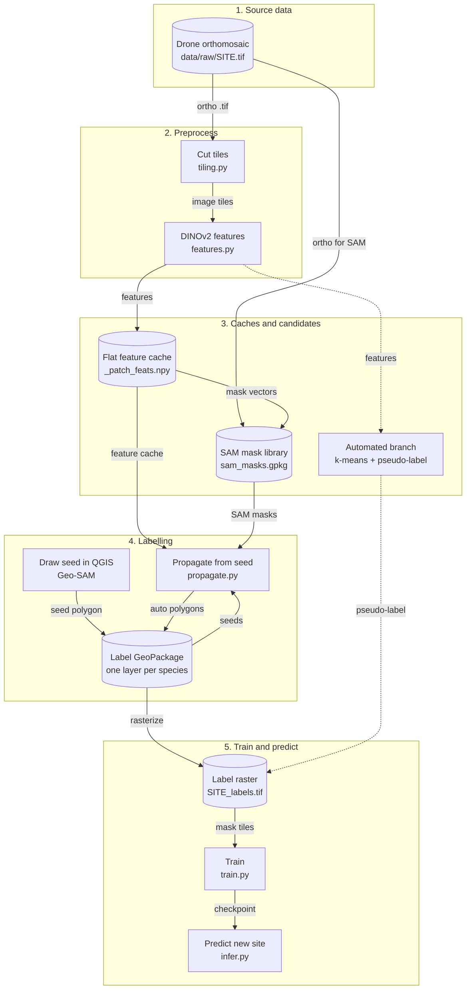

# Bunjilview Alpine Bog Segmentation

Vegetation mapping of alpine bogs (Kosciuszko) from RGB drone orthomosaics.

Three ways to get labelled polygons out of an orthomosaic, sharing one code
base:

| | What you do | What you get | Where |
|---|---|---|---|
| **1. Geo-SAM** | Click a point in QGIS | One polygon per click | `docs/2_geosam_qgis.md` |
| **1.5 Propagation** | Draw one example per species, press a button | Every visually similar patch, automatically | `docs/4_interactive_propagation.md` |
| **2. Full pipeline** | Name ~40 clusters | Pseudo-labels for the whole site | `docs/3_pipeline.md` |

All three feed the same trainer (`src/train.py` -> DeepLabV3+ / SegFormer) and
the same inference script (`src/infer.py`), which writes a GeoTIFF you open
back in QGIS.

---

## System overview

Every step reads what the previous one wrote. The diagram below is the whole
system; the table underneath names the command, the input and the output of
each step.



Solid arrows are the interactive route this project uses day to day. The two
dashed arrows are the fully automated alternative, which skips drawing
entirely and asks a human to name about 40 clusters instead. Both branches end
in the same label raster, so they share `train.py` and `infer.py`.

### Step by step

| # | Step | Command | Input | Output |
|---|------|---------|-------|--------|
| 1 | Cut tiles | `python src/tiling.py --config config.yaml --ortho data/raw/<site>.tif` | the orthomosaic | `data/tiles/<site>/images/`, 512x512 with 64 px overlap |
| 2 | Extract features | `python src/features.py --config config.yaml --site <site>` | image tiles | `data/features/<site>/*.npy`, 768 dims per patch |
| 3 | Build the feature cache | `python src/propagate.py --config config.yaml --site <site> --build-feature-cache` | `data/features/<site>/*.npy` | `_patch_feats.npy` plus its index files, L2 normalised |
| 4 | Build the SAM candidates | `python src/propagate.py --config config.yaml --site <site> --build-sam-cache` | the orthomosaic and the feature cache | `sam_candidates/sam_masks.gpkg` and `sam_feats.npy` |
| 5 | Create the species layers | `python scripts/init_labels_gpkg.py --config config.yaml --site <site>` | the `classes` block of `config.yaml` | `data/labels/<site>/<site>.gpkg`, one layer per species |
| 6 | Start a QGIS session | `exec(open(REPO + '/scripts/repair_session.py').read())` | `BV_REPO` and `BV_SITE` | patched plugin, layers loaded and coloured, `RESULT: 6/6 PASS` |
| 7 | Draw a seed | Geo-SAM: **FG**, click, **S** | the orthomosaic on the canvas | one polygon in the species layer, `source` empty |
| 8 | Propagate | Processing Toolbox, **Propagate species from seed** | the seed plus both caches | polygons in the same layer with `source='auto'` |
| 9 | Clean up | `exec(open(REPO + '/qgis/clean_polygons.py').read())` | the wrong polygons | a layer holding only polygons you accept |
| 10 | Rasterise | `python src/propagate.py --config config.yaml --site <site> --rasterize` | every polygon of every species | `data/pseudo/<site>/<site>_labels.tif`, 1:1 with the ortho |
| 11 | Cut mask tiles | `python src/tiling.py --config config.yaml --ortho data/raw/<site>.tif --mask data/pseudo/<site>/<site>_labels.tif` | the label raster | `data/tiles/<site>/masks/` |
| 12 | Train | `python src/train.py --config config.yaml --site <site>` | image tiles and mask tiles | `checkpoints/<site>/<model>/best.pt` |
| 13 | Predict | `python src/infer.py --config config.yaml --ortho <new>.tif --checkpoint <best>.pt --out <out>.tif` | a new orthomosaic and a checkpoint | a classified GeoTIFF you open in QGIS |

Steps 1 to 5 run once per site. Steps 7 to 9 repeat for each species, and
running step 8 again after a cleanup tightens the result. Steps 10 to 13 run
when the labelling is done.

The automated branch replaces steps 6 to 9 with
`python src/cluster.py` (features to 40 clusters), `python src/naming.py`
(a montage plus a CSV a human fills in) and `python src/pseudolabel.py`
(cluster maps plus the mapping to a label raster). Guide 3 covers it.

An interactive version of the same diagram, with light and dark themes,
search, click to trace a path, and three guided views, is at
[`docs/diagrams/bunjilview-system.html`](docs/diagrams/bunjilview-system.html).
Open it in a browser. It was generated from
[`docs/diagrams/bunjilview-system.dataflow.json`](docs/diagrams/bunjilview-system.dataflow.json).

---

## Contents

- [System overview](#system-overview)
1. [Install](#1-install)
2. [Set up a site](#2-set-up-a-site)
3. [Run: interactive labelling and propagation](#3-run-interactive-labelling-and-propagation)
4. [Run: the automated pipeline](#4-run-the-automated-pipeline)
5. [Train, infer, validate](#5-train-infer-validate)
6. [Everyday commands](#6-everyday-commands)
7. [Troubleshooting](#7-troubleshooting)
8. [Repository layout](#8-repository-layout)
9. [Species](#9-species)

---

## 1. Install

Do this once per machine. It takes 30 to 60 minutes, mostly downloads.

### 1.1 Requirements

| | Minimum | Recommended |
|---|---|---|
| RAM | 16 GB | 32 GB |
| GPU | not required | NVIDIA 8 GB+ or Apple M1+ |
| Disk | 50 GB free | 100 GB+ |
| OS | macOS 12+ / Ubuntu 20+ / Windows 10+ | |
| Python | 3.10+ | 3.11 |

### 1.2 Get the code

```bash
git clone <this-repo> segmentation_model
cd segmentation_model
```

The repository does not contain `data/` or `checkpoints/`: those are excluded
by `.gitignore` because they run to gigabytes. The empty folder structure is
kept by `.gitkeep` files, so you only need to drop your orthomosaic into
`data/raw/`.

### 1.3 Python environment

Conda is the easier route on Windows, because it brings its own GDAL.

**Conda (macOS, Windows, Linux)**

```bash
conda create -n bunjilview python=3.11 -y
conda activate bunjilview
conda install -c conda-forge gdal rasterio -y
pip install -r requirements.txt
```

**venv (macOS, Linux)**

```bash
python3.11 -m venv .venv
source .venv/bin/activate
pip install --upgrade pip
pip install -r requirements.txt
```

**venv (Windows)**

Windows has no `python3.11` command; that naming is a macOS/Linux convention.
Use the `py` launcher instead, which ships with the official python.org
installer:

```bat
py -3.11 -m venv .venv
.venv\Scripts\activate
pip install --upgrade pip
pip install -r requirements.txt
```

If `py -3.11` is not recognized, run `py -0` to list the Python versions
Windows can see. An empty list, or no `py` at all, usually means Python 3.11
was installed without the launcher, or this terminal was opened before the
install finished, in which case a new terminal window picks it up. As a
fallback, call that Python version by its full path instead of `py -3.11`:

```bat
"C:\Users\<you>\AppData\Local\Programs\Python\Python311\python.exe" -m venv .venv
```

**If activation is blocked** (a locked-down company machine where PowerShell's
execution policy disables running `.venv\Scripts\Activate.ps1`): activation
is only a shortcut that adjusts `PATH` for the current terminal, not a
requirement for the environment to work. Skip it entirely and call the
environment's own interpreter directly, by path, for every command:

```bat
.venv\Scripts\python.exe -m pip install --upgrade pip
.venv\Scripts\python.exe -m pip install -r requirements.txt
```

This applies to every `python ...` command later in this README on such a
machine: replace `python` with `.venv\Scripts\python.exe` (or `.venv/bin/python`
on macOS/Linux). It also means you never need admin rights or a PATH change
to use this environment.

If GDAL fails to build on macOS:

```bash
brew install gdal
pip install gdal==$(gdal-config --version)
```

If GDAL fails on Windows with pip, use the conda route above, or install a
prebuilt wheel from https://github.com/cgohlke/geospatial-wheels/releases
before running `pip install -r requirements.txt`.

Check the environment:

```bash
python -c "import torch, rasterio, segmentation_models_pytorch as smp; print(torch.__version__, rasterio.__version__, smp.__version__)"
```

Note down the full path of this interpreter, you need it in section 2:

```bash
python -c "import sys; print(sys.executable)"
```

### 1.4 QGIS and the Geo-SAM plugin

1. Install QGIS 3.28 or newer from https://qgis.org/download.
2. Open QGIS -> **Plugins > Manage and Install Plugins** -> search for
   **Geo-SAM Tool** -> Install.
3. Download the SAM checkpoint the plugin asks for and put it where the
   plugin's settings point. The plugin's own panel tells you which file it
   wants and where it expects it.

QGIS ships its own Python, which has no torch or rasterio. That is deliberate:
QGIS drives the interface, and the heavy work is shelled out to the
environment you built in 1.3.

### 1.5 Patch the Geo-SAM plugin

Geo-SAM was written for Shapefiles. It writes attributes **by column
position**, which is wrong for a GeoPackage, where column 0 is always the
`fid` primary key. Unpatched, your polygon silently disappears when you press
**S**.

Open QGIS -> **Plugins > Python Console** and run, with your own path:

```python
exec(open('/path/to/segmentation_model/scripts/patch_geosam_fields.py').read())
```

You should see `patched: {...}` with four `True` values. The script makes a
backup, checks the syntax of what it wrote, and reverts itself if anything is
wrong. Running it repeatedly is safe.

The patches live inside the QGIS profile, so **they are lost whenever the
plugin is reinstalled or updated**. Just run the line again. In practice you
never run it by hand, because `scripts/repair_session.py` (step 3.1) applies
and verifies it every time.

---

## 2. Set up a site

A "site" is one orthomosaic. Everything is keyed by its name.

Run these in order. Each step consumes what the previous one wrote, so skipping
one makes the next fail:

```bash
python src/tiling.py     --config config.yaml --ortho data/raw/<site>.tif   # 2.2
python src/features.py   --config config.yaml --site <site>                 # 2.3
python src/propagate.py  --config config.yaml --site <site> --build-feature-cache  # 2.4
python src/propagate.py  --config config.yaml --site <site> --build-sam-cache      # 2.5
python scripts/init_labels_gpkg.py --config config.yaml --site <site>       # 2.6
```

### 2.1 Drop the orthomosaic in

```
data/raw/<site>.tif
```

The file name without the extension is the site name. `data/raw/test1.tif`
means the site is `test1`.

### 2.2 Cut the ortho into tiles

```bash
conda activate bunjilview          # or: source .venv/bin/activate
python src/tiling.py --config config.yaml --ortho data/raw/<site>.tif
```

512x512 tiles with 64px overlap, georeference preserved, into
`data/tiles/<site>/images/`. Everything downstream reads tiles, not the
original `.tif`, so this comes first.

### 2.3 Extract the DINOv2 features

```bash
python src/features.py --config config.yaml --site <site>
```

Runs DINOv2 over every tile and writes `data/features/<site>/*.npy`. The first
run downloads the model (~350 MB) into `~/.cache/huggingface/`.

This is the slow step: minutes for a small site, an hour or more for a large
one. Device selection is automatic (CUDA, then MPS, then CPU); force it with
`--device cuda`, `--device mps` or `--device cpu`. It is resume-safe, so if it
is interrupted just run it again and it skips the tiles it has already done.

### 2.4 Build the feature cache

```bash
python src/propagate.py --config config.yaml --site <site> --build-feature-cache
```

Flattens every tile's features into one L2-normalised array that propagation
can search quickly. This step only gathers what 2.3 produced, it does not
compute features itself, so running it before 2.2 and 2.3 fails.

### 2.5 Build the SAM candidate cache

```bash
python src/propagate.py --config config.yaml --site <site> --build-sam-cache
```

Runs SAM automatic mask generation across the ortho and stores every candidate
mask. Propagation later just picks from these, which is why pressing the button
in QGIS takes seconds rather than minutes.

`config.yaml -> propagate.sam.points_per_side` controls the trade-off. It ships
at `8` so your first run finishes quickly; raise it to `32` for finer masks
once the workflow makes sense to you.

Steps 2.4 and 2.5 together write `data/labels/<site>/site.json`, which records
the repo root and the interpreter path. The QGIS side reads it, which is why
you rarely have to configure anything by hand.

### 2.6 Create the species layers

```bash
python scripts/init_labels_gpkg.py --config config.yaml --site <site>
```

This creates `data/labels/<site>/<site>.gpkg` with **one layer per species**,
taken from `config.yaml -> classes`. The layer name *is* the species, so there
is no attribute to fill in when you draw: you pick the layer, you draw, done.

Every layer carries both field sets:

```
Geo-SAM     lb_name, lb_note, group_ulid, N_GM, id, Area, N_FG, N_BG, BBox
Bunjilview  species, source, score, run_ts
```

`source` is `seed` or empty for a polygon you drew, and `auto` for one the
propagation added.

Do **not** create these layers by hand in QGIS. Miss one Geo-SAM field and the
plugin rejects the layer with *"The fields of this vector do not match the SAM
feature fields"*.

### 2.7 Point QGIS Processing at the repo

QGIS -> **Settings > Options > Processing > Scripts > Scripts folders** -> add
the repo's `qgis/` folder -> OK -> restart QGIS.

**Do not use "Add Script to Toolbox"**. That copies the file into the QGIS
profile, and the stale copy then shadows the one in the repo. Every edit you
make afterwards appears to do nothing, which costs an afternoon to work out.

### 2.8 Run steps 2.2-2.6 in one go (Windows)

`run_pipeline.bat`, in the repo root, chains 2.2 through 2.6 into a single
double-clickable script, so a large site can run unattended (overnight, for
example) instead of someone sitting there to launch each step by hand.

Open it in Notepad and edit the two lines near the top:

```bat
set SITE=your_site_name
set ORTHO=C:\path\to\your\image.tif
```

`ORTHO` is the full path to the orthomosaic wherever it actually lives on the
machine, it does not need to be copied into `data\raw` first. Save the file,
then double-click it to run.

Each step runs through PowerShell so progress prints live to the window while
it works, and is also appended to a `run_<site>.log` file next to the script
for checking later. It stops at the first step that fails instead of
continuing on broken input. This still works on a machine where PowerShell's
execution policy blocks running `.ps1` scripts, because it never runs a
script file, only single PowerShell commands passed with `-Command`.

When it finishes, `data/labels/<site>/<site>.gpkg` is ready and section 3
below can start.

---

## 3. Run: interactive labelling and propagation

### 3.1 Start a session

Open QGIS -> **Plugins > Python Console**, and paste these four lines. This is
the only thing you type per session. On Windows keep the `r'...'` prefix so
backslashes are taken literally.

```python
import qgis.utils
qgis.utils.BV_REPO   = r'/path/to/segmentation_model'
qgis.utils.BV_SITE   = 'test1'
exec(open(qgis.utils.BV_REPO + '/scripts/repair_session.py').read())
```

`repair_session.py` is the one command that puts everything in order:

1. Removes anything temporary left attached to the session.
2. Reloads the plugin, applies the four patches, and **verifies** them. If a
   patch is missing it stops there rather than letting you work on a broken
   setup.
3. Loads the ortho and all species layers, one colour each, and binds Geo-SAM.
4. Self-tests: it binds to every layer, draws a test polygon into each, checks
   the values landed in the right columns, and deletes every test polygon
   again.

You want `RESULT: 6/6 PASS`. The same report is written to
`repair_report.txt`.

Optionally set `qgis.utils.BV_PYTHON = r'C:\...\envs\bunjilview\python.exe'`
before the `exec` line. Leave it out and the scripts read the interpreter path
from `data/labels/<site>/site.json`.

### 3.2 Draw seed polygons

1. Click the species layer in the **Layers** panel. Geo-SAM follows your click,
   there is nothing else to switch. The layer colour is the polygon colour.
2. Press **FG** in the Geo-SAM panel (foreground point).
3. Click on the plant in the image. A preview polygon appears.
4. Press **S** to save it.
5. For the next species, click that layer and repeat.

One good seed per species is enough to start. Two or three that look
genuinely different from each other work better.

### 3.3 Propagate

**Processing Toolbox > Scripts > Bunjilview > Propagate species from seed**

Pick the species layer, Run. The script shells out to your Python environment,
matches every cached SAM candidate against the seeds using the DINOv2
features, and appends the accepted ones to the same layer with
`source='auto'`. The canvas refreshes when it finishes.

Two parameters matter:

- **threshold** (default 0.60) is the cosine similarity a candidate must reach.
  Raise it if you are getting patches that are not the species; lower it if
  obvious patches are being missed.
- **margin** (default 0.05) is how far ahead this species must be of the
  runner-up species. It is what stops two look-alike species bleeding into each
  other.

### 3.4 Clean up, then repeat

Delete the wrong polygons before propagating again. This matters more than it
sounds: `seed_sources` counts `auto` polygons as seeds on the next run, so a
bad polygon left in place teaches the next round to find more like it.

Manual deletion in QGIS: select the layer, click **Toggle Editing** (the pencil
in the digitising toolbar, or Ctrl+E), select the polygon, press Delete, then
click the pencil again and save. "Layer not editable" means you skipped the
pencil.

Or use the shortcuts:

```python
exec(open(qgis.utils.BV_REPO + '/qgis/clean_polygons.py').read())

count()                     # polygon count per species layer
delete_selected()           # delete the current selection
delete_auto()               # delete every auto polygon on the active layer,
                            # keeping the ones you drew
delete_auto('Sphagnum_R')   # ... on a named layer
delete_all('Sphagnum_R')    # wipe one layer completely
```

These commit straight to disk, so there is no Ctrl+S and no undo (except for
`delete_selected()` before you save).

Re-running propagation converges: on a real site it added 24, then 12, then 4,
and never produced a duplicate. Two or three rounds with a cleanup in between
is the normal rhythm.

---

## 4. Run: the automated pipeline

The unsupervised route: no drawing at all, you only name clusters.

```bash
conda activate bunjilview
bash run_pipeline.sh <site> data/raw/<site>.tif
```

That runs tiling, DINOv2 features, and k-means clustering, then stops and asks
you to fill in the species column of
`data/clusters/<site>/cluster_names.csv`, looking at
`data/clusters/<site>/cluster_montage.png`. Names must match `config.yaml ->
classes` exactly. Leave a row blank to ignore that cluster.

Then continue:

```bash
bash run_pipeline.sh <site> data/raw/<site>.tif --from-naming
```

which applies the mapping and writes pseudo-label GeoTIFFs to
`data/pseudo/<site>/`.

The individual steps, if you want to run them one at a time:

```bash
python src/tiling.py      --config config.yaml --ortho data/raw/<site>.tif
python src/features.py    --config config.yaml --site <site>
python src/cluster.py     --config config.yaml --site <site>
python src/naming.py      --config config.yaml --site <site> --export-montage
# fill in cluster_names.csv
python src/naming.py      --config config.yaml --site <site> --apply-mapping
python src/pseudolabel.py --config config.yaml --site <site>
```

Deliberate over-clustering (30 to 50 clusters) is the point: Sphagnum R/G/Y
land in separate clusters because their colours differ, and a human makes ~40
decisions instead of tracing thousands of polygons.

---

## 5. Train, infer, validate

```bash
python src/train.py --config config.yaml --site <site> --model deeplabv3plus

python src/infer.py --config config.yaml \
    --ortho data/raw/<site>.tif \
    --checkpoint checkpoints/<name>.pt \
    --out data/pseudo/<site>_pred.tif

python src/validate.py --config config.yaml --checkpoint checkpoints/<name>.pt
```

Inference is sliding-window and averages the logits in the overlaps, so there
are no seams at tile boundaries. `validate.py` prints per-class IoU against a
hand-labelled set in `data/val/`.

**Never use colour augmentation.** Sphagnum R/G/Y can only be told apart by
colour, and D. continentis changes colour with the season. Colour is signal
here, not noise. `src/dataset.py` is limited to flips, 90-degree rotations and
light Gaussian noise for exactly this reason.

---

## 6. Everyday commands

Run these in the QGIS Python Console after the four lines in 3.1.

| Command | What it does |
|---|---|
| `exec(open(REPO + '/scripts/repair_session.py').read())` | Rebuild the session, patch, verify, self-test. Start here every time. |
| `exec(open(REPO + '/qgis/clean_polygons.py').read())` | Load `count()`, `delete_selected()`, `delete_auto()`, `delete_all()`. |
| `exec(open(REPO + '/scripts/test_pipeline.py').read())` | Full end-to-end test suite. Cleans up after itself. |
| `exec(open(REPO + '/scripts/repair_labels_gpkg.py').read())` | Rebuild the GeoPackage when a layer turns read-only or corrupt. |
| `exec(open(REPO + '/scripts/reset_site_labels.py').read())` | **Wipe** every polygon of the site and start from empty layers. |

Substitute `qgis.utils.BV_REPO` for `REPO`, or set `REPO = qgis.utils.BV_REPO`
once.

---

## 7. Troubleshooting

**"No tile_*.npy features in data/features/<site>"**
You skipped step 2.2 or 2.3. `--build-feature-cache` only gathers what
`features.py` produced. Run `tiling.py`, then `features.py`, then the cache
build again.

**"No .tif tiles found" from features.py**
Step 2.2 has not run, or it wrote to a different site name. The site name is
the ortho file name without the extension, and `data/tiles/<site>/images/`
must exist.

**"wrapped C/C++ object of type QgsRasterLayer has been deleted" when pressing FG**
Geo-SAM was still holding an orthomosaic layer that had been removed from the
project. The session script now handles this three ways: it drops the
plugin's reference the moment the ortho is removed, rebinds automatically when
an ortho with the site name is added back, and rebuilds the image source when
you click a species layer. If you still see it, re-run `repair_session.py`,
which reloads the plugin and rebinds from scratch.

**The polygon disappears when I press S.**
The patches are not applied. Run `repair_session.py` and check it reports
`RESULT: 6/6 PASS`. This comes back every time the Geo-SAM plugin is
reinstalled or updated.

**"The fields of this vector do not match the SAM feature fields"**
The layer is missing Geo-SAM fields, usually because it was created by hand in
QGIS. Recreate the layers with `scripts/init_labels_gpkg.py`.

**"Cannot create field group_ulid. A field with the same name already exists."**
Patch 3 is missing. Run `repair_session.py`.

**"Layer not editable: choose 'Start editing' in the digitizing toolbar"**
You are trying to delete a polygon without entering edit mode. Click the pencil
icon (Ctrl+E) first, or use `delete_selected()` from `clean_polygons.py`.

**"Cannot reopen datasource ... in read-only mode" / "disk I/O error"**
A GeoPackage is SQLite, and it does not survive two processes reaching it
through different mounts. Run `scripts/repair_labels_gpkg.py`: it backs up,
diagnoses, rebuilds and copies every feature across. Then keep to one machine
and one path for that file, and do not let Dropbox, Google Drive or OneDrive
sync `data/labels/` while you work.

**The ortho is not visible in QGIS.**
Usually the canvas is zoomed out to the whole world, because empty layers have
an empty extent. Right-click the ortho layer -> **Zoom to Layer**.
`repair_session.py` does this for you when nothing is drawn yet.

**Everything drawn comes out in the same colour.**
Patch 2 is missing. Geo-SAM calls `renderer().setSymbol()`, which only exists
on a single-symbol renderer. Run `repair_session.py`.

**Editing a script in `qgis/` changes nothing.**
There is a stale copy inside the QGIS profile, from "Add Script to Toolbox".
Remove it and point Processing at the repo folder instead (step 2.7).

**Propagation finds nothing, or everything.**
Adjust `threshold` and `margin` (step 3.3). If it is still wrong, your seeds
are probably too few or too similar to each other. Add another seed from a
visually different patch of the same species.

---

## 8. Repository layout

```
segmentation_model/
  README.md                 <- this file: setup and how to run
  config.yaml               <- classes, paths, every hyperparameter
  requirements.txt
  run_pipeline.sh           <- the automated pipeline, end to end
  docs/
    1_setup.md              <- environment setup in detail
    2_geosam_qgis.md        <- Geo-SAM in QGIS (approach 1)
    3_pipeline.md           <- the automated pipeline (approach 2)
    4_interactive_propagation.md  <- propagation from a seed (approach 1.5)
    5_runbook.md            <- start to finish, step by step
    6_new_machine.md        <- installing on another machine
    7_windows_setup.md      <- Windows, start to finish
  qgis/
    setup_geosam_session.py       <- load the site, colour the layers, bind Geo-SAM
    propagate_species_algorithm.py <- the "Propagate species from seed" button
    clean_polygons.py             <- count / delete_selected / delete_auto / delete_all
  scripts/
    init_labels_gpkg.py     <- create one layer per species (once per site)
    patch_geosam_fields.py  <- the four Geo-SAM patches
    repair_session.py       <- ONE command: clean, patch, verify, rebuild, self-test
    repair_labels_gpkg.py   <- rebuild a corrupt or read-only GeoPackage
    reset_site_labels.py    <- wipe a site and start from empty layers
    test_pipeline.py        <- end-to-end test suite
  src/
    tiling.py               <- cut the ortho into tiles
    features.py             <- DINOv2 dense features
    cluster.py              <- k-means over-clustering
    naming.py               <- montage export + CSV of species names
    pseudolabel.py          <- cluster map -> label GeoTIFF
    propagate.py            <- approach 1.5: prototypes + SAM masks -> polygons
    dataset.py              <- PyTorch Dataset (no colour augmentation)
    train.py                <- DeepLabV3+ / SegFormer training loop
    infer.py                <- sliding-window inference
    validate.py             <- per-class IoU
  data/                     <- not in git (see .gitignore)
    raw/<site>.tif          <- put your orthomosaic here
    tiles/ features/ clusters/ pseudo/ val/
    labels/<site>/<site>.gpkg   <- one layer per species, layer name = species
  checkpoints/              <- not in git
```

---

## 9. Species

From `config.yaml -> classes`. The layer names in the GeoPackage are exactly
these strings.

| ID | Layer / species | Common name | Appearance |
|----|---|---|---|
| 0 | `None` | background | unlabelled |
| 1 | `Empidisma_minus` | rope rush | olive |
| 2 | `Dracophyllum_continentis` | candle heath | green to red, seasonal |
| 3 | `Poa_costiniana` | snow grass | tussock |
| 4 | `Carex_gaudichaudiana` | fen sedge | green, wet ground |
| 5 | `Celmisia_pugioniformis` | slender snow daisy | small white flowers |
| 6 | `Sphagnum_R` | sphagnum, red type | red |
| 7 | `Sphagnum_G` | sphagnum, green type | green |
| 8 | `Sphagnum_Y` | sphagnum, yellow type | yellow |
| 9 | `Other` | anything else | |

To add or rename a species, edit `config.yaml -> classes`, then re-run
`scripts/init_labels_gpkg.py` to create the new layer. Nothing is hardcoded
anywhere else.
